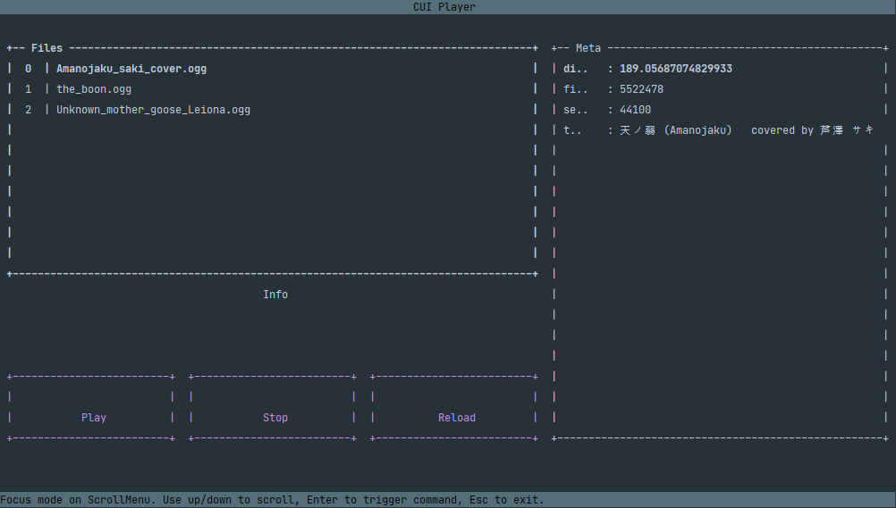

## CUI Audio Player

---

Just a tiny project to create a script that literally does its name.

Originally meant to create a testing bed for learning *sounddevice* module for use in project
[VirtualTrans](github.com/jupiterbjy/VirtualTrans), turns out to be this was pretty challenging and fun.

Therefore, I'm planning to separate this mini - maybe micro - project.

Current status:  

This impressive pre-stone-age program does whopping 4 actions:
- refresh audio folder
- update metadata
- 
