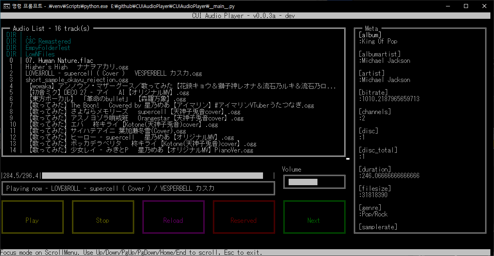

## CUI Audio Player

Just a tiny project to create a script that literally does its name.

*0.0.1a with fixed output*  


---
## Background

Originally meant to create a testing bed for learning *sounddevice* module for use in project
[VirtualTrans](github.com/jupiterbjy/VirtualTrans), turns out to be this was pretty challenging and fun.

Therefore, I've changed *VirtualTrans* repo to *ProjectIncubator*, and separated this using ```subtree split```.

As I find newly discovered [py_cui](https://github.com/jwlodek/py_cui) promising and suits my tastes a lot,
I'm going to finish this project as usable-state unlike my other repos.

Plus, this will be my first repo using git features like milestones, issue, etc -
probably I'll be only one using the latter tho.

---
## Status

*0.0.1a demo*  


This impressive pre-stone-age program does whopping 4 actions:
- refresh audio list
- show *part* of metadata (No joke!)
- play & stop, no pause

---
## Planned features
Will mark those if it's implemented.
- [ ] Bare minimum audio player functions
    - [ ] pause
    - [x] highlight current
    - [x] wrong file handling
    - [ ] library navigation
    - [ ] show progress
    - [ ] Continues play
    - [ ] Shuffle
- [ ] Album art visualizing on some sort of ascii art.
- [ ] lrc support
- [ ] Show freq. map
- [ ] favorites

---
## Things to overcome / overcame

### *py_cui*'s lack of support for 2-width characters
    
  This is caused by some 2-digit characters such as some unicode symbols or CJK letters.
  For now, I used *wcwidth* module to determine actual string length and add trailing ZWSP on each of those letters.
  With actual length and *len()* length now matches, and by slicing and striping outcome - py_cui now don't break up
  like above.
 
### Terrible support of curses on various environment with inconsistent ZWSP and string legnth.
    
  Example footage of curses module at finest. Actually I didn't write like that to pad 2-width chars.
 
  This is primary reason why I am using bare CMD mostly. Spent about weeks on this issue yet to find a working
  terminal on win10. Although this also works on WSL2 with MS Terminal, I can't have a playback there yet.  
 

Either they just don't respond to all the inputs with *py_cui*,  others just don't have proper supports on
  Zero-Width SPace - aka ZWSP - so it breaks all the outputs. I might be better check if I can fix this on
  *py_cui* side, might become somewhat dirty if ever I did.

### Dynamic updating of texts
  As I cut off outputs to prevent py_cui to break, layouts, I need to make a way to remember each lines and cycle per
  line basis to let your see full name of the file. Without help of event loops like *trio*, I'm not quite sure how I
  am supposed to implement it so far.


### Understanding how callback works in sounddevice.OutputStream
  So, to solve above issue - at least for playback percentage sort of things, I need to figure out how to use callback.
  Took long time to temporarily solve this either.
